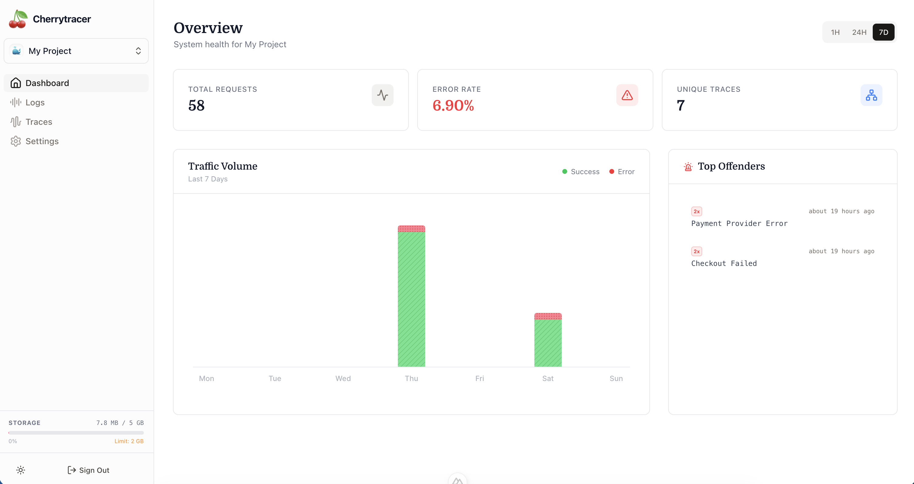

# 🍒 Cherrytracer

**The open-source observability platform for indie hackers who hate configuring Grafana.**

[](https://opensource.org/licenses/MIT)
[](https://bun.sh)
[](https://www.docker.com/)

Cherrytracer is a lightweight, self-hosted alternative to Datadog and Loki. It is designed for **speed**, **simplicity**, and **sanity**.

If you have less than 5 million users and just want to know *"Why is my API 500-ing?"* without learning PromQL, this is for you.



---

## ⚡️ Why Cherrytracer?

Current observability tools are either **too expensive** (Datadog, New Relic) or **too complex** (Prometheus, Grafana, Loki).

Cherrytracer is different:
*   **Zero-Config:** No complex query languages. SQL-driven metrics out of the box.
*   **Tiny Footprint:** The backend runs on Bun + Elysia. The frontend is Nuxt 4. It runs comfortably on a $5 VPS.
*   **Disk Safety:** Built-in "Safety Valve" auto-prunes logs if your disk fills up. It will never crash your server.
*   **Beautiful UI:** A Vercel-like dashboard that feels like a modern SaaS, not a spaceship control panel.

---

## 🚀 Quick Start (Self-Hosted)

You can spin this up in 60 seconds using Docker Compose.

### 1. Docker Compose
Create a `docker-compose.yml`:

```yaml
version: '3.8'

services:
  proxy:
    image: 'nginx:alpine'
    restart: always
    ports:
      - "80:80"
    depends_on:
      - api
      - dashboard
    command: "/bin/sh -c \"echo ' events { worker_connections 1024; }  http { \n  server { \n    listen 80; \n    client_max_body_size 10M;\n\n    # --- API Routes ---\n    location /api/ { \n      proxy_pass http://api:3000; \n      proxy_set_header Host \\$$host;\n      proxy_set_header X-Real-IP \\$$remote_addr;\n      proxy_set_header X-Forwarded-For \\$$proxy_add_x_forwarded_for;\n    } \n\n    location /ingest { \n      proxy_pass http://api:3000; \n      proxy_set_header Host \\$$host;\n      proxy_set_header X-Real-IP \\$$remote_addr;\n    } \n\n    # --- OpenAPI Fix ---\n    # 1. Handle the double-path bug seen in your logs\n    location = /openapi/openapi/json {\n      rewrite ^/openapi/openapi/json$ /openapi/json break;\n      proxy_pass http://api:3000;\n      proxy_set_header Host \\$$host;\n    }\n\n    # 2. Handle standard OpenAPI requests\n    location /openapi { \n      proxy_pass http://api:3000; \n      proxy_set_header Host \\$$host;\n    } \n\n    # --- Websockets ---\n    location /ws { \n      proxy_pass http://api:3000; \n      proxy_http_version 1.1; \n      proxy_set_header Upgrade \\$$http_upgrade; \n      proxy_set_header Connection \\\"Upgrade\\\"; \n      proxy_set_header Host \\$$host; \n    } \n\n    # --- Dashboard (Frontend) ---\n    location / { \n      proxy_pass http://dashboard:3000; \n      proxy_set_header Host \\$$host;\n      proxy_set_header X-Real-IP \\$$remote_addr;\n      proxy_set_header X-Forwarded-For \\$$proxy_add_x_forwarded_for;\n    } \n  } \n}' > /etc/nginx/nginx.conf && nginx -g 'daemon off;'\""

  api:
    image: 'nord21dev/cherrytracer-api:latest'
    restart: always
    command: '/bin/sh -c "cd apps/api && bun run db:push && bun run src/index.ts"'
    environment:
      DATABASE_URL: 'postgres://cherry:cherry@db:5432/cherry'
      JWT_SECRET: auto_generated_internal_secret_key_change_if_you_want
    depends_on:
      db:
        condition: service_healthy

  dashboard:
    image: 'nord21dev/cherrytracer-dashboard:latest'
    restart: always
    environment:
      NODE_ENV: production
      NUXT_API_BASE: 'http://api:3000'
    depends_on:
      - api

  db:
    image: 'postgres:16-alpine'
    restart: always
    volumes:
      - 'cherry_data:/var/lib/postgresql/data'
    environment:
      POSTGRES_USER: cherry
      POSTGRES_PASSWORD: cherry
      POSTGRES_DB: cherry
    healthcheck:
      test:
        - CMD-SHELL
        - 'pg_isready -U cherry -d cherry'
      interval: 5s
      timeout: 5s
      retries: 10

volumes:
  cherry_data:
```

Run it:
```bash
docker-compose up -d
```

*   **Dashboard:** Visit **`http://localhost`**.
*   **API Endpoint:** `http://localhost` (Use this in your SDK).

### 2. Deploy via Coolify / Railway
Cherrytracer is built to be "One-Click" compatible.
*   **Coolify:** Select "Docker Compose" and paste the config above.
*   **Railway:** Deploy from Repo. It automatically detects the Dockerfile.

---

## 📦 Client SDK

Our tiny universal SDK works in **Node.js**, **Bun**, and the **Browser**. It batches logs intelligently, tags them with auto-derived context, and ships them to your Cherrytracer project without risking performance.

### Highlights

* Lightweight & type-safe (<2KB once bundled).
* Runs in browsers (with referer validation) and server runtimes, auto-detecting `NODE_ENV`, hostname, URL, and user agent.
* Queues logs, flushes on timers/tabs becoming hidden, and retries failed batches with exponential backoff.
* Supports structured logging, spans (`traceId` + `parentSpanId`), attributes, and manual `flush` calls for sensitive flows.

For a production-ready guide, configuration table, and tracing deep dive, see `packages/client/README.md`.

### Quick snippet

```typescript
import { Cherrytracer } from "cherrytracer";

const tracer = new Cherrytracer({
  apiKey: "ct_...",
  projectId: "your-project-id",
  keyType: "browser" // optional: inferred automatically
});

tracer.info("App booted", { release: "v1.2.1" });

const span = tracer.startSpan("checkout_flow");
span.info("Started", { cartItems: 4 });
span.end({ status: "success" });
```

The returned span helper exposes `.id`, so use `parentSpanId: span.id` when spawning child spans.

Every log inherits the base context and is stamped with `traceId`, `spanId`, and a fingerprint so the dashboard can group, filter, and visualize traces without additional plumbing.

If you need to correlate logs manually, pass `traceId` (same trace) and `parentSpanId` (keeps the parent/child tree) when starting nested spans; the SDK uses a monotonic clock so `duration_ms` stays reliable even if the system clock jumps.

### Advanced control

Manual `flush()` lets you force an immediate upload (suitable for `beforeunload` or serverless timeouts), while `enabled: false` can disable instrumentation during tests or sensitive operations. The SDK automatically retries failed requests and warns you if a server key is accidentally used in the browser.

---

## 🛠 Architecture

We hate bloat. Here is the entire stack:

*   **Backend:** [ElysiaJS](https://elysiajs.com) (running on Bun) for high-throughput ingestion.
*   **Database:** PostgreSQL + [Drizzle ORM](https://orm.drizzle.team). No specialized time-series DB required.
*   **Frontend:** [Nuxt 4](https://nuxt.com) + Nuxt UI.
*   **Realtime:** WebSockets for live log streaming.

### The "Safety Valve" 🛡️
The #1 fear of self-hosting logs is running out of disk space.
Cherrytracer includes a background worker that checks your Postgres size every hour. If it exceeds your configured limit (e.g., 5GB), it automatically deletes the oldest 10% of logs. **Your server stays alive, always.**

---

## 🤝 Contributing

We welcome PRs from the community!

1.  Clone the repo: `git clone https://github.com/yourusername/cherrytracer.git`
2.  Install dependencies: `bun install`
3.  Start local dev: `bun dev` (Starts DB, API, and UI)

---

## 📜 License

MIT © Sebastian Klein

<div align="center">
  <p>
    <sub>Built with ❤️ for the Indie Web.</sub>
  </p>
</div>
